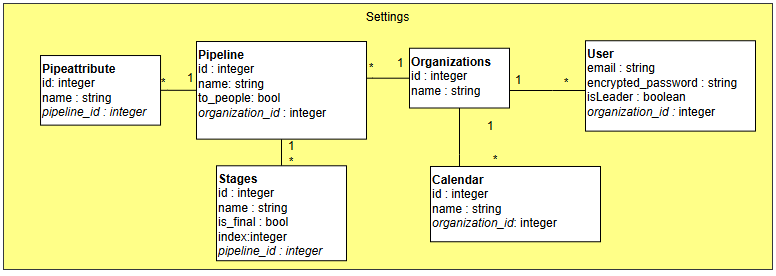
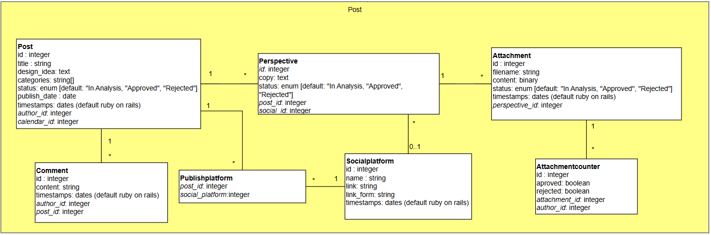
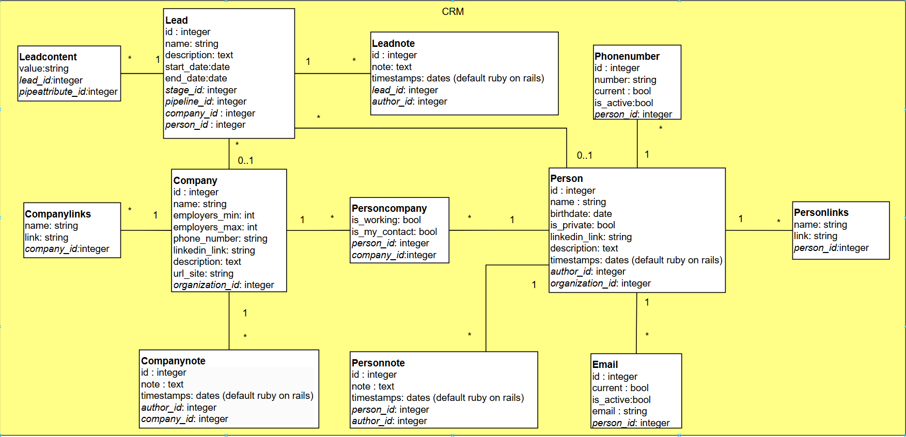
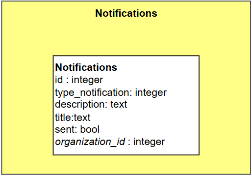

# Projeto Informática - [Wellbeing Warrior](https://www.wellbeing-warrior.com/welcome)

Customer Relationship Management and Marketing Campaigns Management web application. 

Used Technologies:
- Back-end: Ruby on Rails, PostgreSQL
- Front-end: JQuery, JQuery UI, HTML, CSS, Tailwind
- Notifications: Slack
- Deployment: Heroku

# Requirements
 - PostgreSQL *15 or later (check installation guide [here](https://www.postgresql.org/download/))
 - Ruby ^3.3.5 or later (check installation guide [here](https://www.ruby-lang.org/en/documentation/installation/))
 - Rails ^7.2.1 or later (check installation guide [here](https://guides.rubyonrails.org/getting_started.html))

# Installation
To set up the project on your local machine:

1. Clone the repository
```bash
git clone https://github.com/regedor/pi-ww.git
cd pi-ww
```

2. Install the dependencies
```bash
bundle install
```

3. Create a .env  file (like the .env.default file included in this repository) in the root directory and add the following environment variables (change as your needs):
```bash
# Possible Environments: production, development, test
RAILS_ENV=


# ../admin page credentials
SUPER_ADMIN_EMAIL=admin@example.com
SUPER_ADMIN_PASSWORD=your_super_admin_password


# Database credentials
DATABASE_USERNAME=your_database_username
DATABASE_PASSWORD=your_database_password
DATABASE_HOSTNAME=localhost
DATABASE_PORT=5432

# Database names depending on the environment
DATABASE_TEST_DBNAME=pi_ww_test
DATABASE_DEV_DBNAME=pi_ww_development
DATABASE_PROD_DBNAME=pi_ww_production


# SMTP credentials
SMTP_ADDRESS=your_smtp_address
SMTP_PORT=your_smtp_port
SMTP_DOMAIN=your_smtp_domain
SMTP_USERNAME=your_smtp_username
SMTP_PASSWORD=your_smtp_password

# Google OAuth credentials
GOOGLE_OAUTH_CLIENT_ID=your_client_id
GOOGLE_OAUTH_CLIENT_SECRET=your_client_secret

# Slack Workspace Token and channel id (for seed / development test porpuses)
BOT_TOKEN=your_bot_token
BOT_CHANNEL=your_channel_notifications
```

4. Create the database and seed it by running one of the following options:
```bash
rails db:create
rails db:migrate
rails db:seed
```
```bash
sh seed.sh
```

# Usage
To start the server, run one of the following options:
```bash
rails assets:precompile
rails server
```
```bash
sh run.sh
```

Then, visit `http://localhost:3000` in your browser.

# Architecture

The following pictures contains the diagrams developed by the group.

**Multi tentant**:



**Marketing Campaign Management**:



**Customer Relationship Management**:




# Slack Notifications

The following table is used to store notifications in the database.




Each organization must provide a workspace token and a channel so the application can send notifications through Slack. The notification has 4 different types:
- 0 - Create something
- 1 - Updated something
- 2 - Destroy something
- 3 - Updated status on something

To send slack notifications, **before** starting the server for development run the 1st command, for production run the 2nd command:

```bash
whenever --update-crontab --set environment=development
```
```bash
whenever --update-crontab
```

The notifications are set to be sent every minute, but they can be changed to any other time by changing the configuration file `config/schedule.rb`.

# Authors
- [Abhimanyu Aryan](https://github.com/AbhimanyuAryan)
- [André Freitas](https://github.com/justAndre02)
- [José Barbosa](https://github.com/zeisalone)
- [José Carvalho](https://github.com/JoseBambora)
- [Miguel Silva](https://github.com/MiguelCidadeSilva)
- [Pedro Braga](https://github.com/PeRaDi)
- [Tiago Moreira](https://github.com/AdrianoFeixa)
